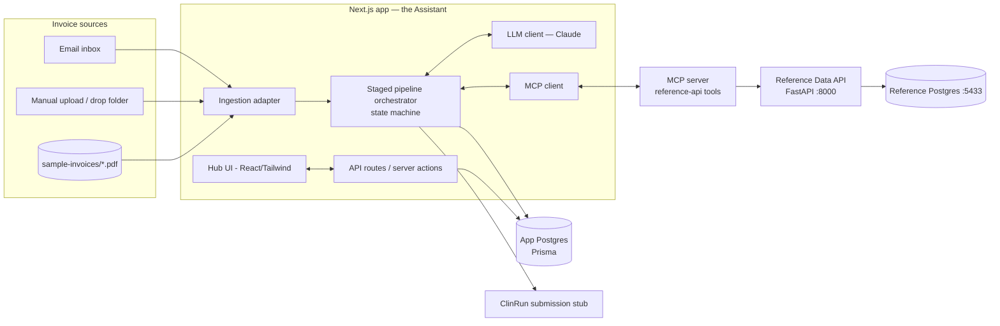
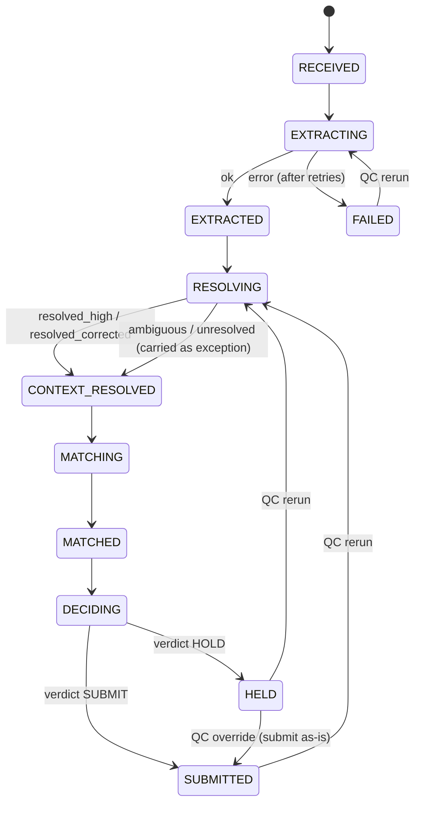
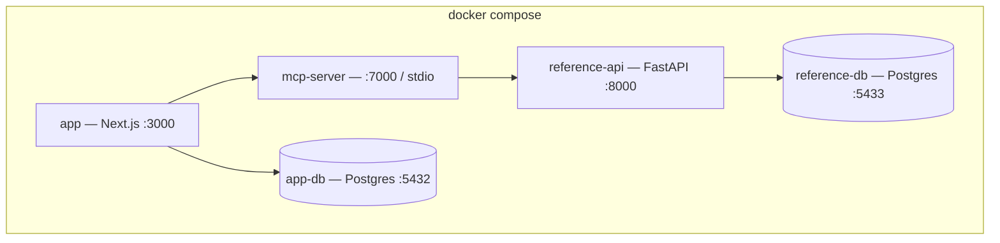

# Architecture — AI Email Invoice Ingestion & Matching Assistant

> Companion to [prd.md](prd.md) · [users.md](users.md) · [plan.md](plan.md)
> **Stack:** Next.js (TypeScript) + Prisma + Postgres · TypeScript MCP server wrapping the reference API · Claude (Anthropic) as the LLM · Tailwind hub · Docker Compose.

---

## 1. System context



The reference API and its Postgres come from the take-home repo (Docker Compose). **Everything our code learns about sponsors/studies/sites/catalog passes through the MCP server** — the orchestrator and the LLM never call the reference API's HTTP endpoints directly. That satisfies the brief's "resolve context via the MCP-wrapped reference API" requirement and gives us one auditable boundary for all reference reads.

---

## 2. Components

| Component | Tech | Responsibility |
|---|---|---|
| **Hub UI** | Next.js App Router, React Server Components + client islands, Tailwind | Queue (submitted vs. held), invoice detail (extracted / matched / exceptions / decision), QC actions, stage timeline. |
| **API layer** | Next.js Route Handlers + Server Actions | CRUD for invoices/runs, trigger ingest/rerun, apply QC corrections, expose decision records. |
| **Ingestion adapter** | TS interface `InvoiceSource` | Normalizes inputs (email attachment, upload, sample file) into a stored `Invoice` + raw file blob. Implementations: `DropFolderSource`, `ImapSource` (optional), `UploadSource`. |
| **Pipeline orchestrator** | TS state machine (plain reducer over `WorkflowState`, no heavyweight engine) | Drives Extract → Resolve → Match → Decide; persists every transition as a `StageEvent`; owns retry/recovery. |
| **LLM client** | Anthropic SDK (`@anthropic-ai/sdk`) | Structured extraction, AI-assisted context resolution, line-item matching, decision rationale. Behind an `LlmClient` interface so the provider is swappable. |
| **MCP client** | `@modelcontextprotocol/sdk` (client) | Connects to the MCP server, lists tools, executes tool calls during the Claude tool-use loop and for deterministic lookups. |
| **MCP server** | `@modelcontextprotocol/sdk` (server) | Wraps the reference API as typed tools (§5). Stateless proxy + light caching. |
| **App database** | Postgres + Prisma | Invoices, extraction/resolution/match results, decisions, QC actions, workflow runs, stage events, submissions. |
| **ClinRun stub** | TS `ClinRunClient` | On SUBMIT, writes a `Submission` record / posts to a local sink. Swappable for a real endpoint. |

> **Two databases, deliberately separate.** The **reference** Postgres (`:5433`, owned by the repo) is read-only canonical data reached only via MCP. The **app** Postgres holds *our* workflow state. They never share a schema or connection.

---

## 3. Data model (Prisma sketch)

```prisma
model Invoice {
  id            String   @id @default(cuid())
  source        String   // email | upload | sample
  fileName      String
  rawUri        String   // stored PDF/image blob
  receivedAt    DateTime @default(now())
  state         InvoiceState @default(RECEIVED)
  run           WorkflowRun?
  extraction    Extraction?
  resolution    ContextResolution?
  lineItems     LineItem[]
  decision      Decision?
  submission    Submission?
  qcActions     QcAction[]
}

enum InvoiceState {
  RECEIVED EXTRACTING EXTRACTED RESOLVING CONTEXT_RESOLVED
  MATCHING MATCHED DECIDING SUBMITTED HELD FAILED
}

model Extraction {            // FR2
  id         String  @id @default(cuid())
  invoiceId  String  @unique
  metadata   Json    // sponsorName, studyName/protocol, siteName, invoiceNo, dates, currency, totals (each with provenance)
  modelInfo  Json    // model id + prompt version + token usage
  confidence Float
}

model ContextResolution {     // FR3
  id          String @id @default(cuid())
  invoiceId   String @unique
  sponsorId   String?
  studyId     String?
  siteId      String?
  studySiteId String?
  status      String // resolved_high | resolved_corrected | ambiguous | unresolved
  evidence    Json   // candidates considered, which signal won, corrections applied
  confidence  Float
}

model LineItem {              // FR2 + FR4
  id              String @id @default(cuid())
  invoiceId       String
  rawDescription  String
  quantity        Float?
  unitPrice       Float?
  amount          Float?
  matchedItemId   String?  // reference catalog_item id (resolved via MCP)
  matchOutcome    String   // matched_high | matched_low | ambiguous | unmatched | price_mismatch
  matchConfidence Float?
  rationale       String?  // why this match
  candidates      Json?    // ranked alternates
}

model Decision {             // FR5
  id        String @id @default(cuid())
  invoiceId String @unique
  verdict   String // SUBMIT | HOLD
  reasons   Json   // ranked list of triggering reasons + evidence
  policyVer String
  decidedAt DateTime @default(now())
}

model QcAction {             // FR7
  id        String @id @default(cuid())
  invoiceId String
  actor     String
  type      String // review | correct_metadata | correct_match | override_decision | rerun | escalate
  before    Json?
  after     Json?
  note      String?
  createdAt DateTime @default(now())
}

model WorkflowRun {
  id        String @id @default(cuid())
  invoiceId String @unique
  events    StageEvent[]
  startedAt DateTime @default(now())
  endedAt   DateTime?
}

model StageEvent {           // NFR5 observability
  id        String @id @default(cuid())
  runId     String
  stage     String // extract | resolve | match | decide
  status    String // started | succeeded | failed | retried | low_confidence
  latencyMs Int?
  tokens    Int?
  inputRef  Json?
  outputRef Json?
  error     String?
  at        DateTime @default(now())
}

model Submission {           // §7 ClinRun stub
  id          String @id @default(cuid())
  invoiceId   String @unique
  payload     Json
  submittedAt DateTime @default(now())
  externalRef String?
}
```

---

## 4. Pipeline & state machine



Key properties:
- **No human gate before `DECIDING`.** The full path RECEIVED→…→SUBMITTED|HELD runs autonomously (brief's core principle).
- **Ambiguity is carried, not blocked.** An `unresolved`/`ambiguous` context still flows to matching/decisioning — it just becomes a HOLD reason. This is what makes it "AI-first": the AI always reaches a verdict.
- **Each stage is a pure-ish function** `(state, deps) -> {newState, StageEvent}`, persisted before the next stage. Crash-safe and replayable.
- **Idempotent rerun.** QC rerun re-enters from a chosen stage with corrected inputs; prior results are versioned, not overwritten destructively.

### Stage responsibilities
1. **Extract (LLM, FR2).** Send the invoice text (PDF text layer; OCR fallback if needed) to Claude with a strict JSON schema → metadata + line items + per-field confidence/provenance.
2. **Resolve context (LLM + MCP, FR3).** Use MCP tools to look up sponsor/study/site candidates; reconcile conflicts (protocol number > study name > sponsor name > site name); produce `ContextResolution` with status + evidence.
3. **Match (LLM + MCP, FR4).** Fetch the **scoped catalog** (`sponsor_id`+`study_id`) via MCP; for each line item, shortlist candidates (lexical/embedding pre-filter to keep prompts bounded on ~100-item catalogs — NFR2), then have Claude pick the best with confidence + rationale; classify outcome (§6 of PRD).
4. **Decide (policy, FR5).** Deterministic policy over resolution + match outcomes + totals reconciliation → `SUBMIT`/`HOLD` + ranked reasons. On SUBMIT, hand to `ClinRunClient`.

---

## 5. MCP server — reference-API tools

The MCP server is a thin, typed proxy over the reference API (`http://reference-api:8000`). Tools mirror the endpoints but add the affordances the agent needs (filtering, scoping, search). All responses unwrap the API's pagination envelope (`{items,total,page,page_size,pages}`).

| MCP tool | Proxies | Inputs | Use |
|---|---|---|---|
| `list_sponsors` | `GET /api/v1/sponsors` | `query?` | Resolve sponsor by name (fuzzy upstream or client-side). |
| `list_studies` | `GET /api/v1/studies` | `sponsorId?`, `query?` | Resolve study/protocol within a sponsor. |
| `list_sites` | `GET /api/v1/sites` | `query?` | Resolve site by name/PI/location. |
| `list_study_sites` | `GET /api/v1/study-sites` | `studyId?`, `siteId?` | Confirm a valid study↔site association. |
| `search_catalog_items` | `GET /api/v1/catalog-items` | `sponsorId`, `studyId`, `query?`, `category?`, `page?`, `pageSize?` (≤200) | Fetch the **scoped** catalog; supports shortlisting for matching. |
| `health` | `GET /health` | — | Readiness check used by orchestrator startup. |

Notes:
- The MCP server holds the reference-API base URL and any credentials; the orchestrator only knows the MCP transport. One boundary, one audit point.
- Light in-memory caching of sponsors/studies/sites (small, slow-changing) reduces latency; catalog reads are cached per `(sponsorId,studyId)` for the duration of a run.
- The same MCP tools are exposed to Claude during the tool-use loop in **Resolve** so the model can *actively* look up candidates, and called deterministically by the orchestrator in **Match** to fetch the scoped catalog.

---

## 6. LLM usage per stage

| Stage | Mode | Output contract |
|---|---|---|
| Extract | Single structured call (`tool`/JSON schema) | `{ metadata, lineItems[] }` with confidences; no free text. |
| Resolve | Tool-use loop with MCP tools | Model proposes sponsor/study/site, calls MCP to verify, returns `{ sponsorId, studyId, siteId, status, evidence }`. |
| Match | Structured call per shortlist | For each line item: `{ catalogItemId | null, confidence, rationale, alternates[] }`. |
| Decide | **No LLM for the verdict** | Verdict is deterministic policy (testable). LLM is used only to render a human-readable summary of the stored reasons, never to *change* the verdict. |

Design choices that keep this explainable and testable:
- **Structured outputs everywhere** (Anthropic tool schemas) → no brittle parsing.
- **Policy, not prompt, owns the decision** → unit-testable thresholds, reproducible verdicts.
- **Prompt + model versions stored** on every result for reproducibility and debugging.
- **Shortlisting before matching** keeps token use bounded as the catalog grows (NFR2).

---

## 7. Error handling, retry & recovery (NFR4)

- **Per-stage retry** with bounded exponential backoff for transient failures (LLM 429/5xx, MCP/network). Retries are recorded as `StageEvent(status=retried)`.
- **Low-confidence is a result, not an error.** A stage that returns below-threshold confidence transitions normally but tags the outcome so the decision policy can HOLD — the invoice never vanishes.
- **Hard failure** after max retries → `FAILED` state with the captured error; visible in the hub; reviewer can `rerun`.
- **Validation gates** between stages (schema validation of LLM output, totals reconciliation) catch malformed data early and attach a structured error.
- **Idempotency**: each stage write is keyed to `(invoiceId, stage, attempt)` so reruns don't corrupt history.
- **MCP/reference-API down**: orchestrator surfaces a clear `resolve`/`match` failure rather than guessing context; invoice parks in `FAILED`/`HELD`.

---

## 8. Observability (NFR5)

- **StageEvent timeline** per invoice (stage, status, latency, tokens, error) — rendered in the hub as a vertical timeline for demo clarity.
- **Structured logs** (pino) keyed by `invoiceId`/`runId`.
- **Decision record** is the human-facing trace: verdict + ranked reasons + per-item evidence, shown verbatim.
- **Metrics counters** for the PRD success metrics (auto-clear rate, exception precision proxy, time-to-decision).

---

## 9. Deployment topology (Docker Compose)



- `reference-api` + `reference-db` come from the repo's `docker-compose.yml` (merged/extended).
- `app` runs Next.js (hub + API + orchestrator). `mcp-server` runs as its own service (or stdio child of the app). `app-db` is our Prisma Postgres.
- One `docker compose up` brings the whole thing up; a seed/`make demo` task ingests the four sample invoices (NFR7).
- **Secrets** (`ANTHROPIC_API_KEY`) injected via env, never committed. Reference-API creds (`ctref/ctref`) live only in the MCP server's env.

---

## 10. Divergence from the repo README

The repo README prescribes a **hard human gate** between metadata resolution and line-item matching ("present for user confirmation — this is a hard gate"). The PRD this build follows (Version 1, 2026-05-17) **explicitly removes that gate**: *"humans are not a required gate before matching and decisioning."*

**Resolution adopted here:** the pipeline runs Extract→Resolve→Match→Decide autonomously; the human "confirmation" the README wanted becomes a **post-decision QC action** (confirm a `resolved_corrected` context, accept a `matched_low`, override a HOLD). The reference API, seed data, sample invoices, and catalog scoping are used exactly as the repo defines them — only the orchestration philosophy differs. This is called out so a reviewer comparing against the README understands the deliberate choice.

---

## 11. Why these choices (rationale)

- **MCP as the single reference boundary** → directly satisfies the brief, isolates all canonical reads, and makes context resolution auditable.
- **Deterministic decision policy over LLM signals** → explainability and testability (the brief grades "how decisions are reached," not document-AI accuracy).
- **State machine + StageEvents** → the "observable workflow state transitions" the brief asks for, and crash-safe reruns.
- **Two-DB separation** → keeps canonical reference data read-only and our mutable workflow state isolated.
- **TypeScript/Next.js full-stack** → one language across hub, API, orchestrator, and MCP server; fast iteration in the 2–3 day box; Prisma gives a typed, observable data layer.
