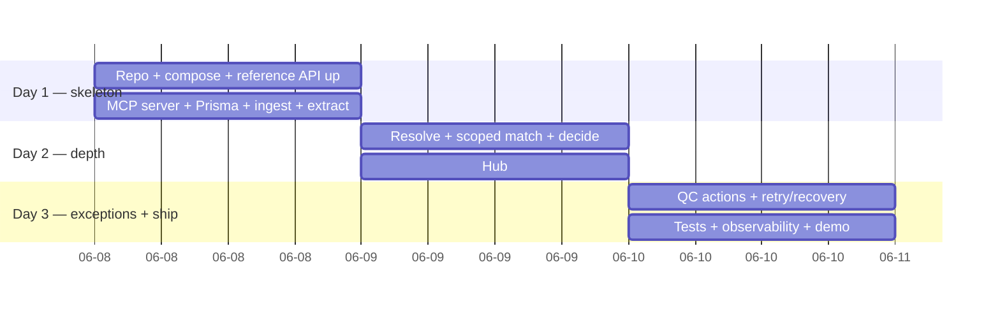

# Implementation Plan — AI Email Invoice Ingestion & Matching Assistant

> Companion to [prd.md](prd.md) · [users.md](users.md) · [architecture.md](architecture.md)
> **Time box:** 2–3 days · **Stack:** Next.js + Prisma + Postgres · TS MCP server · Claude.

The plan is sequenced so there is a **working end-to-end skeleton by the end of Day 1** (even if matching is crude), then depth and exception handling on Day 2, then polish, tests, and the demo on Day 3. The biggest risk in a take-home is a beautiful single stage that never connects — so we connect first, then deepen.

---

## Milestones at a glance

---

## Phase 0 — Setup (½ day, Day 1 AM)

**Goal:** the reference stack runs and we can talk to it; project scaffold compiles.

- [ ] Clone `ledgerrun/ai-takehome-test`; bring up its `docker-compose.yml`; confirm `GET :8000/health` and `:8000/docs`; eyeball seed data (sponsors/studies/sites/catalog) and the 4 sample PDFs.
- [ ] Scaffold Next.js (TS, App Router) + Tailwind + Prisma; add `app-db` Postgres to a merged compose file; `prisma migrate dev` on the §3 schema.
- [ ] Wire `ANTHROPIC_API_KEY` from env; add `LlmClient` interface + Anthropic impl with a trivial round-trip test.
- [ ] Repo hygiene: `.env.example`, README run steps, `make demo` placeholder.

**Exit:** `docker compose up` → reference API + app + app-db all healthy; Prisma schema migrated; Claude reachable.

---

## Phase 1 — MCP server + ingest + extraction (½ day, Day 1 PM)

**Goal:** an invoice goes from file → stored, structured extraction; reference data reachable only via MCP.

- [ ] **MCP server** (`@modelcontextprotocol/sdk`): implement the six tools in [architecture.md §5](architecture.md#5-mcp-server--reference-api-tools); unwrap pagination; light caching. Manual tool-call smoke test.
- [ ] **MCP client** in the app; `health` check at startup.
- [ ] **Ingestion adapter** `InvoiceSource`: `UploadSource` + `DropFolderSource` (point it at `sample-invoices/`). Store `Invoice` + raw blob. PDF text extraction (`pdf-parse`/`pdfjs`); stub OCR fallback behind the same interface.
- [ ] **Extract stage** (FR2): Claude structured call → `{metadata, lineItems[]}` with provenance/confidence; persist `Extraction` + `LineItem[]`; write `StageEvent`s.

**Exit (end of Day 1):** run `simple-invoice.pdf` through ingest→extract and see structured metadata + 5 line items in the DB, with a stage timeline. **Skeleton is end-to-end through extraction.**

---

## Phase 2 — Resolve, match, decide (1 day, Day 2)

**Goal:** the autonomous core — context resolution, scoped matching, and the submit/hold verdict.

- [ ] **Resolve stage** (FR3): Claude tool-use loop over MCP tools → sponsor/study/site; conflict reconciliation (protocol# > study name > sponsor name > site name); statuses `resolved_high|resolved_corrected|ambiguous|unresolved`; persist `ContextResolution` with evidence.
- [ ] **Match stage** (FR4): `search_catalog_items(sponsorId,studyId)` scoped fetch; **shortlist** candidates per line item (lexical + optional embeddings) to bound prompt size on the ~100-item catalog (NFR2); Claude picks best + confidence + rationale; classify outcome incl. `price_mismatch` via tolerance check.
- [ ] **Decide stage** (FR5): deterministic policy ([prd.md §6](prd.md#6-decision-model-submit-vs-hold)) → `SUBMIT|HOLD` + ranked reasons; persist `Decision`. On SUBMIT, `ClinRunClient` writes a `Submission`.
- [ ] **Orchestrator** state machine glue (Extract→Resolve→Match→Decide), each transition persisted; idempotent.

**Exit:** all four samples run fully autonomously to a verdict with correct outcomes per [prd.md §9](prd.md#9-acceptance-scenarios-provided-samples) (simple→SUBMIT; medium/large/mismatched→HOLD with the right reasons).

---

## Phase 3 — The hub (overlaps Day 2 PM → Day 3 AM)

**Goal:** post-decision visibility + the read path reviewers live in.

- [ ] **Queue** view: two lanes — Submitted vs. Held/Exceptions; counts; per-row state badge.
- [ ] **Invoice detail** (FR6): extracted fields (with provenance), matched line items (catalog target + confidence + rationale), exceptions list, totals reconciliation, submit/withhold banner.
- [ ] **Decision record** panel: verdict + ranked reasons + per-item evidence, verbatim.
- [ ] **Stage timeline** (NFR5): StageEvents with status/latency/tokens/errors.

**Exit:** a reviewer can open any sample invoice and understand *what happened and why* without reading logs.

---

## Phase 4 — QC actions + recovery (Day 3 AM)

**Goal:** the human controls and predictable failure behavior.

- [ ] **QC actions** (FR7): review, correct metadata, correct/re-point match, accept `matched_low`, override decision, **rerun** (re-enter from chosen stage), **escalate**. Each writes a `QcAction`.
- [ ] **Rerun** path verified on `medium` (accept price line → SUBMIT) and `mismatched-metadata` (confirm correction → SUBMIT).
- [ ] **Retry/recovery** (NFR4): bounded backoff on LLM/MCP transient errors; `FAILED` state surfaced + rerunnable; totals/schema validation gates.

**Exit:** every held sample can be driven to a clean SUBMIT (or deliberate escalate) through the hub; injected failures recover predictably.

---

## Phase 5 — Tests, observability, demo (Day 3 PM)

**Goal:** prove it and show it.

- [ ] **Tests** (see strategy below) green for core + exception paths.
- [ ] **Observability** pass: structured logs, metrics counters for the PRD success metrics.
- [ ] **`make demo`**: one command ingests all four samples and prints/links the resulting verdicts.
- [ ] **README + short demo script/recording**; verify cold `docker compose up` from clean checkout.

---

## Test strategy

Maps to the brief's "test coverage for core and exception paths."

| Level | What | Examples |
|---|---|---|
| **Unit (pure)** | Decision policy, tolerance math, conflict-resolution priority, outcome classification | price_mismatch at +2.1% → exception; unmatched < 0.60; protocol# overrides wrong sponsor name |
| **Unit** | MCP tool input/output mapping, pagination unwrap, catalog scoping | `search_catalog_items` passes `sponsor_id`+`study_id`; ≤200 page size |
| **Contract** | LLM output schema validation; reject/repair malformed extraction | missing line amount → validation error, not crash |
| **Integration (mockable LLM)** | Full stage chain on each sample using **recorded** Claude responses (fixtures) so tests are deterministic and offline | each of the 4 samples → expected verdict + reasons |
| **Integration (live, optional)** | One smoke run against real Claude + reference API | gated behind an env flag |
| **Recovery** | Inject MCP/LLM failure → retry then `FAILED`; rerun recovers | transient 429 retried; hard failure parks + rerunnable |

LLM determinism: record real Claude responses once into fixtures; the suite replays them so CI is offline, fast, and stable while still exercising the real prompts/schemas.

---

## Definition of done (traceability)

| Req | Done when… |
|---|---|
| FR1 | All 4 samples ingest via the adapter; email-source interface present (drop-folder demonstrated). |
| FR2 | Extraction yields validated metadata + line items with provenance for all 4. |
| FR3 | Context resolves via MCP for all 4, incl. the corrected mismatched-metadata case. |
| FR4 | Line items matched against the scoped catalog; large/~100-item case stable. |
| FR5 | Each invoice gets an autonomous SUBMIT/HOLD with a stored, explainable decision record. |
| FR6 | Hub shows extracted/matched/confidence-exceptions/submit-withhold per invoice. |
| FR7 | Review, correct, rerun, escalate all work; held samples reach SUBMIT via QC. |
| FR8 | Behavior verified across easy/ambiguous/mismatched samples ([prd.md §9](prd.md#9-acceptance-scenarios-provided-samples)). |
| NFR1–7 | Stable runs, bounded large-catalog matching, responsive hub, predictable recovery, observable transitions, modular stages, one-command bring-up. |

---

## Risks & mitigations

| Risk | Likelihood | Mitigation |
|---|---|---|
| Over-investing in one stage; never connecting end to end | High | Day-1 skeleton-first rule; crude-but-connected before deep. |
| Large catalog blows the matching prompt | Med | Shortlist/retrieval before the LLM call (NFR2); cap candidates. |
| Mismatched-metadata logic gets fragile | Med | Explicit, unit-tested conflict-priority rules; carry as HOLD, don't guess silently. |
| LLM nondeterminism makes tests flaky | Med | Record/replay fixtures; policy (not LLM) owns the verdict. |
| PDFs need real OCR | Low | Samples are text-extractable; OCR fallback stubbed behind the extraction interface. |
| README hard-gate expectation vs. brief's AI-first | Low | Documented divergence ([architecture.md §10](architecture.md#10-divergence-from-the-repo-readme)); QC = post-decision confirmation. |
| Time box overrun | Med | Phases ordered by value; Phase 5 polish is compressible; email connector + embeddings are explicitly optional. |

---

## Explicitly deferred (post-hackathon)

Real Gmail/Graph email connector · embeddings-backed semantic matching (lexical shortlist ships first) · real ClinRun endpoint · auth/RBAC · feedback loop that learns thresholds from QC corrections · analytics dashboard beyond the basic metrics.
